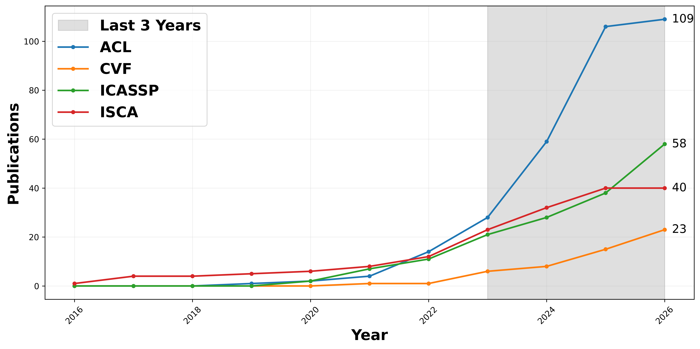

# Publication Trends

## Description

The figure shows publication trends for long-form research from 2016 to 2026
across representative venues, based on data collected on June 12, 2026.

## Search Protocol

The statistics were obtained by searching for the query `long-form` in paper
titles. The selected venues are:

- ACL: natural language processing
- CVF: computer vision
- ICASSP: speech processing
- ISCA: speech processing

## Note

These results should be interpreted as selective evidence of publication trends,
rather than as an exhaustive bibliographic analysis, since they are based on
representative venues used as proxies for different research areas.
